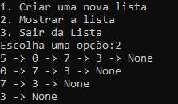

<h1 align="center">Listas Encadeadas</h1>

 

  

Esse é um programa para estudar como funciona as listas encadeadas com o uso de algumas funções aplicada a elas.
 

<h1 align="center">Pré-Requisito</h1>

- Instalação versão Python 3.11 .

 

<h1 align="center"> Criação da Lista Encadeada</h1>

-  As listas encadeada são formadas por nodos. Os nodos são compostos por uma variavél  e um ponteiro  que aponta para o nodo da lista seguinte.   

<h1 align="center"> Criação das Funções</h1>

- **def insert** 

 
 Essa função permite o inserir um dado em uma posição dentro de uma lista. 
 
 

-  **def exibir**

 
Essa função exibe todos os elementos adicionados a lista.
 

-  **def sair**

 Usado o comando exit para sair do programa.
 

<h1 align="center"> Criação do Menu</h1>

 Para criação do Menu foi usado o While para criação de um  loop, que permite que  enquanto  for verdadeiro o programa irá executar as ações referentes a opção escolhida. 

 

<h1 align="center">Editor Usado</h1>

- Todo o código foi desenvolvido no Visual Studio Code.

 

<h1 align="center">Licença</h1>

- MIT License.

 
